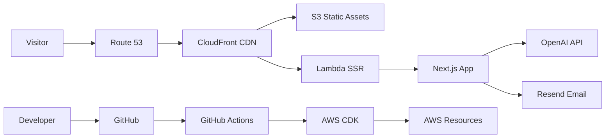
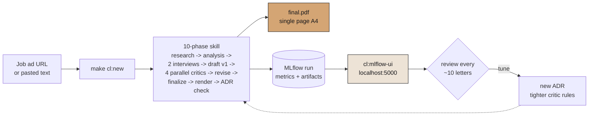

# Portfolio Website — Reebal Sami

[](https://github.com/ReebalSami/portfolio-website/actions/workflows/ci.yml)
[](https://nextjs.org)
[](https://typescriptlang.org)
[](LICENSE)

Personal portfolio website for **Reebal Sami** — Data Scientist & AI Engineer based in Hamburg, Germany.

A single-page application showcasing projects, skills, career timeline, technical blog, and an AI chatbot — built with engineering best practices including IaC, CI/CD, i18n with RTL, accessibility, and performance optimization.

## Architecture



> Full architecture diagram: [`docs/architecture.d2`](docs/architecture.d2) (render with [D2](https://d2lang.com))

## Tech Stack

| Category | Technology |
|----------|-----------|
| **Framework** | Next.js 16 (App Router, RSC, standalone output) |
| **Language** | TypeScript 5.9 |
| **Styling** | Tailwind CSS 4 + shadcn/ui |
| **Animations** | Framer Motion 12 |
| **i18n** | next-intl 4 (EN, DE, ES, AR + RTL) |
| **Blog** | MDX with Shiki syntax highlighting |
| **AI Chatbot** | Vercel AI SDK + OpenAI gpt-4o-mini |
| **Infrastructure** | AWS CDK (S3, CloudFront, Lambda, Route 53, ACM) |
| **CI/CD** | GitHub Actions |
| **Testing** | Vitest + Playwright |
| **Package Manager** | pnpm 9 |

## Getting Started

### Prerequisites

- **Node.js** 24.x LTS (pinned via Volta in `package.json`)
- **pnpm** 9.x (`corepack enable`)
- [Volta](https://volta.sh) recommended (or nvm/asdf)

### Installation

```bash
make env:setup   # Sync Volta + Corepack toolchain
make install     # Install dependencies
cp .env.example .env.local  # Configure environment
make dev         # Start dev server → http://localhost:3000
```

### Available Commands

```bash
make dev           # Development server (Turbopack)
make build         # Production build
make lint          # ESLint + TypeScript type-check
make format        # Prettier formatting
make test          # Vitest unit tests
make test:e2e      # Playwright E2E tests
make build:deploy  # Build for AWS Lambda deployment
make deploy:diff   # CDK diff (preview stage)
make deploy:preview # Deploy preview stage
make deploy:prod   # Deploy production
make diagram       # Render D2 architecture diagram
make config:validate # Validate config/site.yaml
make cv:all        # Generate PUBLIC ATS + Visual CV PDFs (deployed), plus PRIVATE Visual CV if config/cv/cv.private.yaml exists
make cv:ats        # Generate public ATS CV only + verify
make cv:visual     # Generate public Visual CV only
make cv:verify     # Verify public ATS text extraction
make cv:validate   # Validate CV YAML data
make cv:private    # Generate PRIVATE Visual CV (real contact info, LOCAL ONLY)
```

Cover letter system commands are local-only (gitignored); see the dedicated section below.

## Configuration

### `config/site.yaml` — Single Source of Truth

All site parameters (metadata, contact info, feature flags, design tokens, AWS config) live in `config/site.yaml`. Parsed at build time by `src/lib/config.ts` and validated with Zod.

### Environment Variables (`.env.local`)

| Variable | Description |
|----------|-------------|
| `CHATBOT_API_KEY` | OpenAI API key for AI chatbot |
| `RESEND_API_KEY` | Resend API key for contact form |
| `AWS_ACCESS_KEY_ID` | AWS credentials (deployment) |
| `AWS_SECRET_ACCESS_KEY` | AWS credentials (deployment) |

### Feature Flags

Toggle features in `config/site.yaml`:

```yaml
features:
  blog: true
  chatbot: true
  contactForm: true
  darkMode: true
  analytics: false
  rss: true
  downloadCV: true
```

## Project Structure

```
portfolio-website/
├── .github/workflows/     # CI/CD (ci.yml, deploy.yml, preview.yml)
├── config/site.yaml       # Site configuration (single source of truth)
├── docs/                  # Architecture docs & diagrams
├── infra/                 # AWS CDK infrastructure (TypeScript)
│   ├── bin/app.ts         # CDK app entry point
│   ├── lib/               # CertificateStack + PortfolioStack
│   └── test/              # CDK assertion tests
├── config/cv/             # CV data (YAML) + design tokens
├── public/cv/             # Generated CV PDFs (ats/ + visual/)
├── scripts/typst/         # Typst CV templates (ats/ + visual/)
├── scripts/generate-cv.ts # Typst PDF generation pipeline
├── src/
│   ├── app/[locale]/      # Next.js pages (i18n routing)
│   ├── components/        # React components
│   │   ├── cards/         #   ProjectCard, BlogCard
│   │   ├── chat/          #   ChatWidget, ChatMessage, ChatInput
│   │   ├── layout/        #   Header, Footer, Navigation
│   │   ├── sections/      #   Hero, About, Projects, Contact
│   │   ├── shared/        #   TechBadge, GeometricShapes, etc.
│   │   └── ui/            #   shadcn/ui primitives
│   ├── content/           # Blog posts (MDX), project data
│   ├── hooks/             # Custom React hooks
│   ├── i18n/              # next-intl configuration
│   ├── lib/               # Config, MDX, utils
│   ├── messages/          # Translation files (en/de/es/ar.json)
│   └── types/             # TypeScript types
├── tests/
│   ├── unit/              # Vitest unit tests
│   └── e2e/               # Playwright E2E tests
└── Makefile               # All project commands
```

## Internationalization (i18n)

Supports 4 locales: **English** (default), **German**, **Spanish**, **Arabic** (RTL). All four are now fully populated across app strings and CV content.

Translation files: `src/messages/{en,de,es,ar}.json`

To add a translation key:
1. Add the key to all 4 JSON files
2. Use `useTranslations('namespace')` in components
3. See `.windsurf/workflows/add-translation.md` for the full workflow

**Next up** — audience-tuned transcreation for AR (Gulf-first) and ES (Andalusia-focused) with section-level tone routing. Baseline translations are machine-assisted; see [`CHANGELOG.md`](CHANGELOG.md) for status.

## Blog

MDX blog posts live in `src/content/blog/{locale}/`. Each post has frontmatter:

```yaml
---
title: "Post Title"
date: "2025-01-15"
description: "Short description"
tags: ["ai", "python"]
---
```

Features: Shiki syntax highlighting, reading time, table of contents, RSS feed.

### Editorial MDX primitives

Blog posts compose three typed components from `src/components/blog/`:

| Component | Purpose |
|-----------|---------|
| `BlogPhoto` | Standard bordered blog image with caption |
| `Polaroid` | Tilted instant-photo aesthetic with handwritten caption |
| `SplitRow` | Magazine-style photo-floats-in-text layout |

All three register into a shared `GalleryProvider` via the `useBlogGalleryItem` hook and open a custom lightbox built on [yet-another-react-lightbox](https://github.com/igordanchenko/yet-another-react-lightbox) (Zoom plugin, gesture-first — zoom UI hidden, custom chrome for counter / caption / arrows / thumbnail strip).

**MDX gotcha** — `next-mdx-remote/rsc` silently drops numeric JSX expression props. MDX-facing components that accept numbers (e.g. `SplitRow.rotate`) declare their prop as `number | string` and coerce internally; MDX call sites pass strings (`rotate="-3"`).

## CV System

Two outputs, one source of truth. All PDFs are generated via **Typst** (typesetting engine).

| Target | Source YAML(s) | Layouts | Output | Deployed? |
|--------|----------------|---------|--------|-----------|
| `make cv:all` | `cv.public.yaml` (+ private chain below if local file present) | ATS + Visual | `public/cv/{ats,visual}/resume_reebal_sami.pdf` | **Yes** (at `/cv`) |
| `make cv:private` | `cv.full.yaml` + `cv.private.yaml` | Visual only | `cover-letter/cv_private/resume_reebal_sami.pdf` | No — gitignored |

The public CV uses an obfuscated contact (`contact@reebal-sami.com`) and has no phone, no address, no references. The private CV merges `cv.full.yaml` (git-tracked mirror of `cv.public.yaml` with application-specific wording — e.g. “my portfolio” instead of “this portfolio” — plus a references skeleton) with `cv.private.yaml` (gitignored) which provides the real email, phone, address, and full reference contacts. Use it when sending a CV directly to a recruiter.

`make cv:all` runs both: the two public PDFs always regenerate, and the private PDF regenerates only if `config/cv/cv.private.yaml` exists locally — so the target is safe to run on any clone of this repo.

### Architecture

```mermaid
flowchart LR
    PUB[config/cv/cv.public.yaml<br/>git-tracked<br/>content source of truth] --> GEN[scripts/generate-cv.ts]
    PRIV[config/cv/cv.private.yaml<br/>GITIGNORED<br/>real contact + refs overlay] -.-> GEN
    DES[config/cv/cv-design.yaml] --> TYP

    GEN -- "--source public<br/>both ATS + Visual" --> TYP[Typst<br/>cv-ats.typ<br/>cv-visual.typ]
    GEN -- "--source private<br/>Visual only, merged in memory" --> TYP

    TYP -- public --> DEPLOY[public/cv/&#123;ats,visual&#125;/<br/>DEPLOYED to site]
    TYP -- private --> LOCAL[cover-letter/cv_private/<br/>LOCAL ONLY]

    style PRIV stroke-dasharray: 4 4
    style DEPLOY fill:#D4A574,stroke:#18181B,color:#18181B
    style LOCAL fill:#EDE3D6,stroke:#18181B,color:#18181B
```



### Key design decisions

- **Single source of truth for content**: `cv.public.yaml` holds every job, education entry, skill, project, and interest. The private overlay only adds contact-style fields — it never rewords career content.
- **Private is Visual-only**: there is no private ATS variant. ATS is for machine parsing of the deployed public CV; direct applications go out as a Visual CV paired with a cover letter.
- **All spacing controlled by YAML tokens** — `par(spacing: 0pt)` and `block(above: 0pt, below: 0pt)` kill Typst defaults; every gap is explicit.
- **ATS verification** — `pdftotext` extraction checked for correct section order, key content presence, and the expected email.
- **Meta lines** styled with accent color (`#D4A574`) and max font weight.
- **Justified text** in both templates.
- **Locale routing** — shared helpers in `scripts/typst/shared/locale.typ`; all four locales (EN / DE / ES / AR) fully populated in `cv.public.yaml`.
- **Content changes**: edit `config/cv/cv.public.yaml` (and mirror into `cv.full.yaml` if the change should also apply to the private CV), run `make cv:all`, then `make deploy`. `cv:all` regenerates both public PDFs and — when `cv.private.yaml` exists — the private PDF too.

### Generating the CV

```bash
# Public variants (deployed at reebal-sami.com/cv)
make cv:all
make cv:ats              # public ATS only (with verify)
make cv:visual           # public Visual only
make cv:verify           # re-verify public ATS text extraction

# Private variant for direct job applications (LOCAL ONLY; merges cv.private.yaml)
make cv:private          # Visual only → cover-letter/cv_private/resume_reebal_sami.pdf
make cv:private:clean    # wipe cover-letter/cv_private/

# Prerequisite for cv:private: create config/cv/cv.private.yaml (gitignored) once.
# Required keys:
#   basics.email_personal, basics.phone, basics.location.{address,postalCode},
#   references[] with name/position/company/relation/phone/email/visibility.
```

## Cover Letter System (local only)

Story-first, ATS-aware, AI-tell-free cover-letter generator. Runs in **Cascade** (Windsurf) or **Claude Code**, renders to single-page A4 PDF via Typst, logs every run to local MLflow for trend analysis. The entire `cover-letter/` directory (including generated PDFs, skills, subagents, and private profile data) is **gitignored** and never committed.

### High-level flow



### Full documentation

See [`cover-letter/README.md`](cover-letter/README.md) — which is **gitignored**, so only visible on your local machine. That file contains:
- All 10 pipeline phases with inputs / outputs
- The 4 critics (patterns / specificity / voice / story-harmony) and their thresholds
- MLflow setup + live walkthrough
- "Starting a new job application in a fresh conversation" prompt template (canonical boot prompt for Cascade / Claude Code)
- Retrospective + queued ADR candidates
- LinkedIn DMA integration (EU self-serve)

### The one prompt you need in a fresh conversation

Paste this in any new Cascade or Claude Code session to boot the skill:

```
Use the cover-letter skill for a new job.

Company: <Company name>
Role: <Role title>
Language: de   (or en)
Job ad URL: <paste URL>

If the URL is gated, paste the ad between the fences below.

--- BEGIN JOB AD ---
<full ad text>
--- END JOB AD ---

Notes: <optional — warm contact, a specific angle, etc.>
```

The full template with explanations lives at `cover-letter/NEW-CONVERSATION.md` (also gitignored).

## Deployment

### AWS Infrastructure (CDK)

The site deploys to AWS via CDK:
- **S3** — static assets (private, OAI)
- **Lambda** — Next.js SSR (via Lambda Web Adapter)
- **CloudFront** — CDN, SSL, HTTP/2+3, security headers
- **Route 53** — DNS (custom domain)
- **ACM** — TLS certificate (us-east-1)
- **CloudWatch** — 5xx rate, latency, Lambda error alarms

See [`infra/README.md`](infra/README.md) for full AWS prerequisites, current runtime versions, and deployment guide. Change history for runtime/infra upgrades lives in [`CHANGELOG.md`](CHANGELOG.md).

### CI/CD Pipeline

| Workflow | Trigger | Action |
|----------|---------|--------|
| **CI** | Push / PR | Lint, typecheck, unit tests, E2E, build, CDK synth |
| **Deploy** | Push to main | Build + CDK deploy to production |
| **Preview** | PR to main | Build + CDK deploy to preview stage |

## Testing

```bash
make test        # Unit tests (Vitest)
make test:e2e    # E2E tests (Playwright — Chromium, Firefox, WebKit)
```

## Design System

NFT Art Gallery / Exaggerated Minimalism style. Dark mode (default) + light mode toggle.

- **Fonts**: Archivo (headings), Space Grotesk (body), JetBrains Mono (code)
- **Colors**: Gallery black primary, warm peachy accent, oklch color space
- **Components**: shadcn/ui base with custom TechBadge, GeometricShapes, SectionHeading

Full design system: [`design-system/reebal-sami-portfolio/MASTER.md`](design-system/reebal-sami-portfolio/MASTER.md)

## License

MIT
