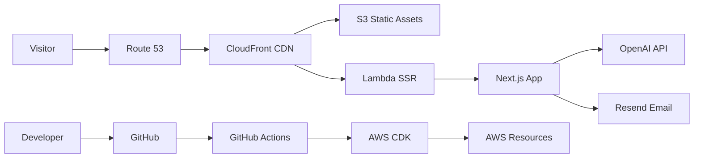

# Portfolio Website — Reebal Sami

[](https://github.com/ReebalSami/portfolio-website/actions/workflows/ci.yml)
[](https://nextjs.org)
[](https://typescriptlang.org)
[](LICENSE)

Personal portfolio website for **Reebal Sami** — Data Scientist & AI Engineer based in Hamburg, Germany.

A single-page application showcasing projects, skills, career timeline, technical blog, and an AI chatbot — built with engineering best practices including IaC, CI/CD, i18n with RTL, accessibility, and performance optimization.

## Architecture



> Full architecture diagram: [`docs/architecture.d2`](docs/architecture.d2) (render with [D2](https://d2lang.com))

## Tech Stack

| Category | Technology |
|----------|-----------|
| **Framework** | Next.js 16 (App Router, RSC, standalone output) |
| **Language** | TypeScript 5.9 |
| **Styling** | Tailwind CSS 4 + shadcn/ui |
| **Animations** | Framer Motion 12 |
| **i18n** | next-intl 4 (EN, DE, ES, AR + RTL) |
| **Blog** | MDX with Shiki syntax highlighting |
| **AI Chatbot** | Vercel AI SDK + OpenAI gpt-4o-mini |
| **Infrastructure** | AWS CDK (S3, CloudFront, Lambda, Route 53, ACM) |
| **CI/CD** | GitHub Actions |
| **Testing** | Vitest + Playwright |
| **Package Manager** | pnpm 9 |

## Getting Started

### Prerequisites

- **Node.js** 20.x (pinned via Volta / `.nvmrc`)
- **pnpm** 9.x (`corepack enable`)
- [Volta](https://volta.sh) recommended (or nvm/asdf)

### Installation

```bash
make env:setup   # Sync Volta + Corepack toolchain
make install     # Install dependencies
cp .env.example .env.local  # Configure environment
make dev         # Start dev server → http://localhost:3000
```

### Available Commands

```bash
make dev           # Development server (Turbopack)
make build         # Production build
make lint          # ESLint + TypeScript type-check
make format        # Prettier formatting
make test          # Vitest unit tests
make test:e2e      # Playwright E2E tests
make build:deploy  # Build for AWS Lambda deployment
make deploy:diff   # CDK diff (preview stage)
make deploy:preview # Deploy preview stage
make deploy:prod   # Deploy production
make diagram       # Render D2 architecture diagram
make config:validate # Validate config/site.yaml
```

## Configuration

### `config/site.yaml` — Single Source of Truth

All site parameters (metadata, contact info, feature flags, design tokens, AWS config) live in `config/site.yaml`. Parsed at build time by `src/lib/config.ts` and validated with Zod.

### Environment Variables (`.env.local`)

| Variable | Description |
|----------|-------------|
| `CHATBOT_API_KEY` | OpenAI API key for AI chatbot |
| `RESEND_API_KEY` | Resend API key for contact form |
| `AWS_ACCESS_KEY_ID` | AWS credentials (deployment) |
| `AWS_SECRET_ACCESS_KEY` | AWS credentials (deployment) |

### Feature Flags

Toggle features in `config/site.yaml`:

```yaml
features:
  blog: true
  chatbot: true
  contactForm: true
  darkMode: true
  analytics: false
  rss: true
  downloadCV: true
```

## Project Structure

```
portfolio-website/
├── .github/workflows/     # CI/CD (ci.yml, deploy.yml, preview.yml)
├── config/site.yaml       # Site configuration (single source of truth)
├── docs/                  # Architecture docs & diagrams
├── infra/                 # AWS CDK infrastructure (TypeScript)
│   ├── bin/app.ts         # CDK app entry point
│   ├── lib/               # CertificateStack + PortfolioStack
│   └── test/              # CDK assertion tests
├── public/                # Static assets (images, CV, icons)
├── scripts/               # Build & deployment scripts
├── src/
│   ├── app/[locale]/      # Next.js pages (i18n routing)
│   ├── components/        # React components
│   │   ├── cards/         #   ProjectCard, BlogCard
│   │   ├── chat/          #   ChatWidget, ChatMessage, ChatInput
│   │   ├── layout/        #   Header, Footer, Navigation
│   │   ├── sections/      #   Hero, About, Projects, Contact
│   │   ├── shared/        #   TechBadge, GeometricShapes, etc.
│   │   └── ui/            #   shadcn/ui primitives
│   ├── content/           # Blog posts (MDX), project data
│   ├── hooks/             # Custom React hooks
│   ├── i18n/              # next-intl configuration
│   ├── lib/               # Config, MDX, utils
│   ├── messages/          # Translation files (en/de/es/ar.json)
│   └── types/             # TypeScript types
├── tests/
│   ├── unit/              # Vitest unit tests
│   └── e2e/               # Playwright E2E tests
└── Makefile               # All project commands
```

## Internationalization (i18n)

Supports 4 locales: **English** (default), **German**, **Spanish**, **Arabic** (RTL).

Translation files: `src/messages/{en,de,es,ar}.json`

To add a translation key:
1. Add the key to all 4 JSON files
2. Use `useTranslations('namespace')` in components
3. See `.windsurf/workflows/add-translation.md` for the full workflow

## Blog

MDX blog posts live in `src/content/blog/{locale}/`. Each post has frontmatter:

```yaml
---
title: "Post Title"
date: "2025-01-15"
description: "Short description"
tags: ["ai", "python"]
---
```

Features: Shiki syntax highlighting, reading time, table of contents, RSS feed.

## Deployment

### AWS Infrastructure (CDK)

The site deploys to AWS via CDK:
- **S3** — static assets (private, OAI)
- **Lambda** — Next.js SSR (via Lambda Web Adapter)
- **CloudFront** — CDN, SSL, HTTP/2+3, security headers
- **Route 53** — DNS (custom domain)
- **ACM** — TLS certificate (us-east-1)
- **CloudWatch** — 5xx rate, latency, Lambda error alarms

See [`infra/README.md`](infra/README.md) for full AWS prerequisites and deployment guide.

### CI/CD Pipeline

| Workflow | Trigger | Action |
|----------|---------|--------|
| **CI** | Push / PR | Lint, typecheck, unit tests, E2E, build, CDK synth |
| **Deploy** | Push to main | Build + CDK deploy to production |
| **Preview** | PR to main | Build + CDK deploy to preview stage |

## Testing

```bash
make test        # Unit tests (Vitest)
make test:e2e    # E2E tests (Playwright — Chromium, Firefox, WebKit)
```

## Design System

NFT Art Gallery / Exaggerated Minimalism style. Light mode (default) + dark mode.

- **Fonts**: Archivo (headings), Space Grotesk (body), JetBrains Mono (code)
- **Colors**: Gallery black primary, warm peachy accent, oklch color space
- **Components**: shadcn/ui base with custom TechBadge, GeometricShapes, SectionHeading

Full design system: [`design-system/reebal-sami-portfolio/MASTER.md`](design-system/reebal-sami-portfolio/MASTER.md)

## License

MIT
