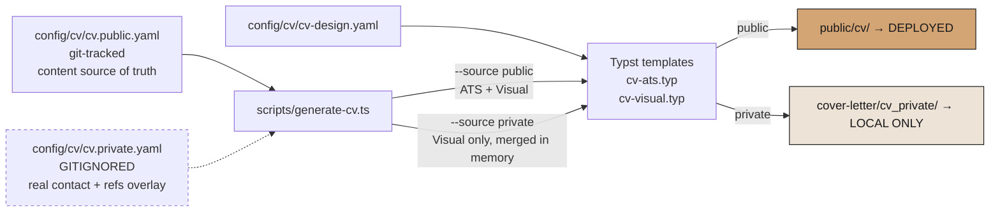
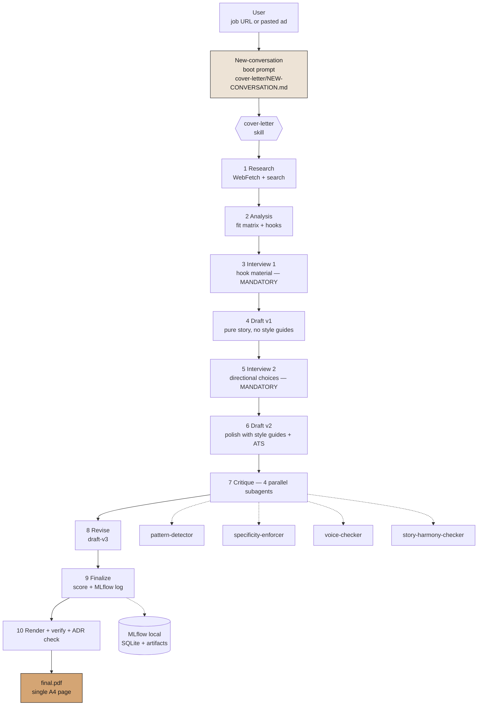

# Architecture Documentation

## Overview

This portfolio website is a **Next.js 16 application** deployed to AWS via CDK. It uses a single-page scroll layout with server-side rendering, internationalization (4 locales), an AI chatbot, and a full CI/CD pipeline.

## Design Decisions

### Single-Page Scroll Layout

All sections (Hero, About, Projects, Blog, Contact) render on a single page (`src/app/[locale]/page.tsx`). Navigation uses smooth scroll to section IDs (`#home`, `#about`, `#projects`, `#blog`, `#contact`). Active section is tracked via Intersection Observer.

**Rationale**: Portfolio sites benefit from a continuous narrative. Scroll-based navigation provides a natural reading flow and reduces page load latency.

### Configuration System

All configurable values live in `config/site.yaml`:

```
config/site.yaml → src/lib/config.ts (Zod validation) → src/types/config.ts (types)
```

- **Single source of truth** — change YAML, propagates everywhere
- **Type-safe** — Zod validates at build time, TypeScript types inferred
- **Secrets** — `.env.local` only (never in YAML or source)
- **Feature flags** — toggle blog, chatbot, analytics via config

### Design System

Generated via **UI UX Pro Max** with NFT Art Gallery / Exaggerated Minimalism style.

- **Colors**: oklch color space via CSS custom properties. Gallery black primary (`#18181B`), warm peachy accent (`oklch 0.82 0.08 55`)
- **Fonts**: Archivo (headings), Space Grotesk (body), JetBrains Mono (mono), IBM Plex Sans Arabic (Arabic)
- **Dark mode**: `next-themes` with class strategy, dark default
- **Components**: shadcn/ui (base-nova style) with custom components

Persisted in `design-system/reebal-sami-portfolio/MASTER.md`.

## Infrastructure

### AWS Architecture

```
┌─────────┐     ┌───────────┐     ┌──────────────────────┐
│ Visitor  │────▶│ Route 53  │────▶│ CloudFront (CDN)     │
└─────────┘     └───────────┘     │  - HTTP/2 + HTTP/3   │
                                  │  - TLS 1.2+ (ACM)    │
                                  │  - Security headers   │
                                  │  - Brotli/Gzip       │
                                  └───────┬──────┬───────┘
                                          │      │
                              ┌───────────┘      └───────────┐
                              ▼                              ▼
                    ┌──────────────────┐          ┌─────────────────┐
                    │ S3 Bucket        │          │ Lambda Function │
                    │ (Static Assets)  │          │ (Next.js SSR)   │
                    │ - _next/static/* │          │ - Lambda Web    │
                    │ - images/*       │          │   Adapter       │
                    │ - cv.pdf         │          │ - Standalone    │
                    │ - Block public   │          │   output        │
                    └──────────────────┘          └────────┬────────┘
                                                          │
                                                  ┌───────┴───────┐
                                                  ▼               ▼
                                          ┌────────────┐  ┌────────────┐
                                          │ OpenAI API │  │ Resend API │
                                          │ (Chatbot)  │  │ (Email)    │
                                          └────────────┘  └────────────┘
```

### CDK Stacks

| Stack | Region | Purpose |
|-------|--------|---------|
| **CertificateStack** | us-east-1 | ACM certificate (CloudFront requires us-east-1) |
| **PortfolioStack** | eu-central-1 | All application resources |

Cross-region references handled via SSM parameters (CDK `crossRegionReferences: true`).

### Stages

| Stage | Domain | Use |
|-------|--------|-----|
| `preview` | `preview.reebal-sami.com` | PR previews, testing |
| `prod` | `reebal-sami.com` | Production |

### Lambda Web Adapter

Instead of custom Lambda handlers, we use the [AWS Lambda Web Adapter](https://github.com/awslabs/aws-lambda-web-adapter) layer. It runs the Next.js standalone server inside Lambda and translates Lambda events to HTTP requests.

Benefits:
- No custom adapter code
- Supports response streaming via Lambda Function URL
- Same server.js locally and in Lambda

**Current versions** (see `infra/README.md#runtime` for the full table):
- Lambda runtime: `nodejs24.x`
- Web Adapter layer: `LambdaAdapterLayerX86:27`

### Build Pipeline

```
pnpm build (standalone) → scripts/build-for-deploy.sh → .deploy/
  .deploy/server/  → Lambda function code
  .deploy/static/  → S3 bucket assets
```

## CI/CD Pipeline

```
                    ┌───────────────┐
                    │  git push     │
                    └───────┬───────┘
                            │
                ┌───────────┴───────────┐
                ▼                       ▼
        ┌───────────────┐       ┌───────────────┐
        │ Any branch    │       │ main branch   │
        │               │       │               │
        │ CI workflow:  │       │ Deploy:       │
        │ - lint        │       │ - build       │
        │ - typecheck   │       │ - package     │
        │ - unit tests  │       │ - cdk deploy  │
        │ - E2E tests   │       │   (prod)      │
        │ - build       │       │               │
        │ - CDK synth   │       └───────────────┘
        └───────────────┘
```

### Workflows

- **ci.yml** — Runs on every push and PR. Parallel jobs: lint+typecheck, unit tests, E2E tests, build, CDK synth+tests.
- **deploy.yml** — Runs on push to `main`. Builds Next.js for Lambda, deploys via CDK to production.
- **preview.yml** — Runs on PR to `main`. Deploys preview stage, posts comment with URL.

### Required GitHub Secrets

| Secret | Description |
|--------|-------------|
| `AWS_ACCESS_KEY_ID` | IAM deployment user |
| `AWS_SECRET_ACCESS_KEY` | IAM deployment user |
| `CHATBOT_API_KEY` | OpenAI API key |
| `RESEND_API_KEY` | Resend email API key |

## i18n Implementation

### Routing

next-intl 4 with middleware-based locale detection:

```
Request → Middleware → Detect locale → Redirect to /[locale]/...
```

- Default locale: `en` (no prefix for default)
- Supported: `en`, `de`, `es`, `ar`
- RTL: `ar` locale sets `dir="rtl"` on `<html>`

### Translation Files

`src/messages/{locale}.json` — namespaced by component/section:

```json
{
  "hero": { "greeting": "Hello, I'm", ... },
  "about": { "title": "About Me", ... },
  "navigation": { "home": "Home", ... }
}
```

### RTL Support

- Arabic locale (`ar`) activates RTL via `dir="rtl"` on root element
- Tailwind logical properties: `ms-`/`me-`/`ps-`/`pe-` (not `ml-`/`mr-`)
- Arabic font: IBM Plex Sans Arabic

## Chatbot Architecture

### In-Context RAG

The AI chatbot uses **in-context RAG** (no vector database):

1. `src/content/chatbot-context.md` contains structured knowledge about Reebal
2. On each request, the full context is injected as a system message
3. Vercel AI SDK v6 streams responses from OpenAI gpt-4o-mini

### Rate Limiting

In-memory rate limiting: 10 requests per IP per hour. Reset on Lambda cold start.

### API Route

`src/app/api/chat/route.ts`:
- POST with `{ messages: [...] }`
- Streaming response via `toTextStreamResponse()`
- System prompt + chatbot-context.md injected

## Performance Strategy

### Lighthouse Targets

- Performance: 90+
- Accessibility: 90+
- Best Practices: 90+
- SEO: 90+

### Optimizations

- **Static generation** for locale pages (ISR)
- **Image optimization** via Next.js Image component
- **Font optimization** via `next/font` (display: swap, preload)
- **Code splitting** via dynamic imports
- **CloudFront caching** — static assets cached for 30 days, SSR uncached
- **Brotli + Gzip compression** via CloudFront
- **HTTP/2 + HTTP/3** via CloudFront
- **Security headers** — CSP, HSTS, X-Frame-Options, X-Content-Type-Options

### CV System

Two targets, one content source of truth. All PDFs generated via **Typst** (modern typesetting engine; no Playwright / React / headless browser):



- **Public content source**: `cv.public.yaml` holds every job, education entry, skill, project, and interest for the deployed CV.
- **Private content source**: `cv.full.yaml` (git-tracked, safe-for-public-repo) is a manually-parity-enforced mirror of `cv.public.yaml` with application-specific wording (e.g. “my portfolio” instead of “this portfolio”) and a references skeleton. `cv.private.yaml` (gitignored) overlays contact-style fields (email, phone, address, reference contacts) — it never rewords career content.
- **ATS layout**: single-column, justified, `pdftotext`-verified section order + expected email check.
- **Visual layout**: two-column sidebar, photo, warm design tokens.
- **Public target** (`make cv:all`): obfuscated `contact@reebal-sami.com`, no phone, no address, no references; deployed at `/cv/{ats,visual}`. `make cv:all` additionally runs the private target if `config/cv/cv.private.yaml` exists locally — so one command keeps all three PDFs in sync.
- **Private target** (`make cv:private`): merges `cv.full.yaml` + `cv.private.yaml` in memory → Visual-only PDF at `cover-letter/cv_private/resume_reebal_sami.pdf`; gitignored (via `cover-letter/**`), never deployed. Use this when sending a CV directly to a recruiter.
- **Root fix**: `par(spacing: 0pt)` + `block(above: 0pt, below: 0pt)` globally — all spacing from YAML tokens.
- **Web view**: `/[locale]/cv` renders `PortfolioGalleryTheme` (React) + `CvDownloadFab` with both public PDF links.
- **Content updates**: edit `cv.public.yaml` (and mirror career-content changes into `cv.full.yaml` if the private CV should also pick them up) → `make cv:all` → `make deploy`. `cv:all` regenerates public + private (if `cv.private.yaml` is present), so no separate re-run is needed.

### SEO

- Structured data (JSON-LD) for Person, WebSite
- Open Graph + Twitter Card meta tags
- Dynamic OG image generation (`opengraph-image.tsx`)
- `sitemap.xml` and `robots.txt` generated at build time
- Canonical URLs per locale

## Cover Letter System

Story-first cover letter generator that runs entirely inside Cascade (Windsurf) / Claude Code, renders to single-page A4 PDF via Typst, and logs every run to local MLflow for trend analysis. The whole subsystem is **gitignored** and local-only — see `cover-letter/README.md` for the full spec.

### System map



### Integration points with the rest of the system

- **CV data reuse**: cover letter Typst template reads `config/cv/cv.public.yaml` (name / title / location) + `config/cv/cv.private.yaml` (real email / phone) directly. No duplication.
- **Design token reuse**: `cover-letter/config/letter-design.yaml` shares font families (Archivo / Space Grotesk / Caveat) with the CV's `cv-design.yaml` — visually consistent brand.
- **Gitignore boundary**: the entire `cover-letter/` tree is gitignored (see root `.gitignore`). Same for `.claude/skills/cover-letter/`, `.claude/agents/cover-letter-*.md`, and all of `.windsurf/`.
- **Deploy safety**: Typst compiles to PDF; there is no Next.js route, so the cover letter cannot accidentally be deployed (unlike an HTML route which would need a 404 guard).

### Key subsystems

- **Four parallel critics** (`.claude/agents/cover-letter-*.md`): pattern-detector, specificity-enforcer, voice-checker, story-harmony-checker. Each emits `scores-*.json`; aggregator rolls up into `scores.json`.
- **MLflow tracking** (ADR-002): SQLite backend at `cover-letter/mlruns/mlflow.db`, artifacts at `cover-letter/mlruns/artifacts/`. Install via `make cl:mlflow-setup` (one command, uses `uv`). Log runs via `make cl:mlflow-log`. UI via `make cl:mlflow-ui` on `:5000`.
- **ADR system** (`cover-letter/decisions/`): every non-trivial system decision is an ADR. `REVIEW_TRIGGERS.yaml` tells `make cl:adr-check` when to re-examine each one. Stale ADRs surface during Phase 10 of letter generation.
- **LinkedIn DMA integration** (EU self-serve): pulls your own LinkedIn data via the DMA Member Data Portability API. Pinned to `LinkedIn-Version: 202312`. See `cover-letter/README.md` §LinkedIn for details.

### Why this is architecturally safe

The cover letter system touches many files but carefully respects boundaries:
- Read-only on `config/cv/*.yaml` (no mutations to CV data)
- Read-only on `scripts/typst/shared/locale.typ` (imports the helper, doesn't change it)
- Own templates / design tokens / scripts / Makefile fragment (`cover-letter/local.mk` loaded via `-include` from root `Makefile`)
- Own gitignored output tree — no interference with `public/cv/` deployed assets
