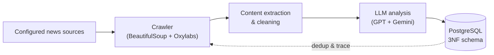
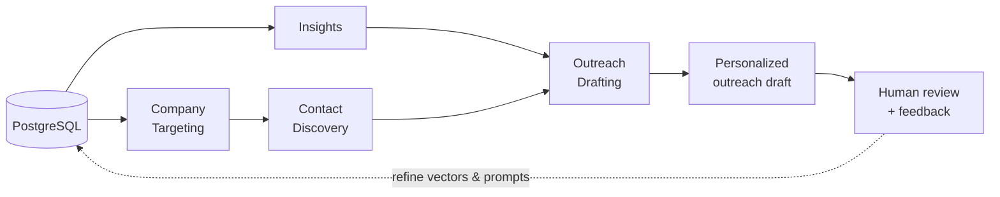

## Before the agents

Datalogue is a small Hamburg company. The sales team had a quiet, expensive problem: qualifying B2B leads is slow, uneven, and hard to scale. A single lead could eat a whole morning — five tabs open, a paragraph copied from a German trade paper into one document, a snippet from a Chinese press release into another, twenty minutes on LinkedIn trying to find the right decision-maker, then an outreach email that had to sound remotely personal.

They hired me as an AI & Data Science working student in June 2025 (20h/week, alongside my M.Sc.) to see if this could be compressed. Six months later, the pipeline cut manual research by roughly half. This post is the honest version — what I actually built, what surprised me, and three things I got wrong before I got them right.

<BlogPhoto
  src="/images/blog/b2b-sales-leads/me-first-day-at-work-at-datalogue-at-the-pentry.jpeg"
  alt="Reebal at the Datalogue pantry on his first day"
  caption="Day one at Datalogue. The pantry, where a lot of the real problem got defined over coffee."
  width={1600}
  height={1200}
/>

## The shape of the problem

It took a few weeks to see it clearly. On paper it looked like "build a chatbot." In practice the sales team was doing two different jobs:

1. **Discovery** — scanning news for companies that might soon need what Datalogue sells.
2. **Deep research** — once a company was flagged, finding the right person and writing a useful email.

Trying to do both in one agent was a mess. Too many instructions, too many tools, long runtimes, unpredictable output. I split it into two components with one database between them.

<B2bArchitectureDiagram />

## Component 1 — the news-crawler

A generic pipeline that plugs into any configured news source:

New article URLs get deduplicated against the database before crawling. Each article gets crawled, cleaned, passed through an LLM that pulls out structured signals — company name, what they do, why they might be relevant — and lands in PostgreSQL with a full audit trail.

Two design choices paid off later:

- **Structured outputs with Pydantic.** Every LLM call returns a validated schema. No free-form JSON parsing. If the model can't produce the schema, the call fails loudly and gets retried.
- **Prompt versioning, never overwrites.** Each prompt variant is saved as a new file. The old runs stay comparable. The real value isn't the archive — it's being able to ask *"which phrasing change moved quality, and by how much?"* Without versioning that question has no answer.

## Component 2 — the multi-agent research app

A Streamlit app running four LLM agents over shared state, backed by the same PostgreSQL database:

- **Company Targeting** — identifies concrete target companies from the crawler signals.
- **Insights** — synthesizes what we know about a company into a brief.
- **Contact Discovery** — finds the decision-maker with domain and contact verification.
- **Outreach Drafting** — writes a personalized email using the brief plus the verified contact.

Human-in-the-loop feedback from the sales team (thumbs up, thumbs down, short comments) feeds back into the vector store and prompt revisions. The system improves the more the team uses it.

## The unexpected door

We assumed from day one that this project was about speed. It wasn't, not entirely.

No one on the team read Mandarin well. Certain industries had strong, early signals in Chinese sources the team couldn't tap at all. The crawler doesn't care what language an article is in — it extracts structured signals and the LLM writes the brief in English. For the first time, Chinese news became a real input channel for a German sales team.

That wasn't a speed optimization. It was a **new channel of opportunity** — a market we couldn't previously afford to investigate suddenly became part of the weekly pipeline. When you translate a workflow into agents, you sometimes open doors that were closed not because they were locked, but because opening them was too expensive.

## Three things I got wrong the first time

### Aiming for 100% when 80% ships

I spent two weeks trying to make the Outreach Drafting agent produce emails good enough to send untouched. It never happened. The last 20% — tone match, company-specific phrasing — was hard even for humans. Meanwhile the team was still doing everything manually.

Once I accepted that "80% good draft, five-minute human edit" was the real product, we shipped in a week. Every time I've pushed past 80% in a complex multi-agent system, I've lost more than I saved. Ship the 80%, watch what users actually edit, fix the hot spots.

### Latency was not a nice-to-have

The first end-to-end run took about 30 minutes. Fine for an overnight batch. Terrible for a sales person who wants to fire off three outreaches before their next meeting.

The fix wasn't moving work to nightly batches — the team needed real-time results. Two levers, in order:

First, **agents that don't depend on each other shouldn't wait for each other**. I restructured the pipeline around `asyncio.gather()` so Company Research, Contact Discovery, and the news-crawler insights fan out concurrently instead of running in a neat single-file queue. The synthesis step then consumes whichever finishes first. A 30-minute sequential run collapsed toward the time of the slowest branch.

Second, **swap in less capable but faster, cheaper models for steps where mild quality loss was acceptable** (parts of Insights, parts of Contact Discovery) and keep the strongest models only where they actually moved the needle (Outreach Drafting). Latency dropped another order of magnitude. Quality on the critical path stayed.

If you're not tracking per-agent latency from day one, you'll design a system your users will quietly hate.

### Testing with the sales team, not for them

I wrote evaluation scripts at my desk. I pinged the team on Teams. I got polite thumbs-ups and a feeling that something was off. Then I sat next to the person using the tool for a week. Watched where they hesitated. Watched which fields they muted. That single week produced more useful changes than a month of eval runs.

The loop that actually worked: ship a small change, stand up with the team for ten minutes, watch them use it, ship the next one. Incremental, slightly clunky, much faster than building the next big version in isolation.

## The stack

Python · Streamlit · Agno · OpenAI (GPT) and Gemini (cross-model for article analysis) · Function Calling · Structured Outputs · Pydantic · SQLAlchemy · PostgreSQL (3NF, normalized) · vector search for company matching · BeautifulSoup and Oxylabs for crawling · Docker.

## What I'd do differently next time

- Parallelize agent calls earlier — easy wins in latency come from fan-out, not from picking a faster model.
- Build a small eval suite before scaling. Even 30 labeled examples catch regressions that "it looks fine" never will.
- Design the human feedback loop as a first-class feature from day one. The system that gets better over time beats the one that launched slightly better.

---

The project stays proprietary, but there's a [public showcase repo](https://github.com/ReebalSami/b2b-sales-lead-multi-agent-pipeline-showcase) with the architecture, approach, and results.
